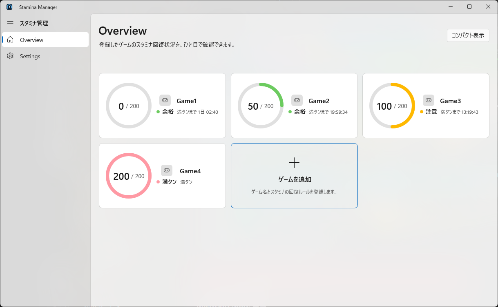
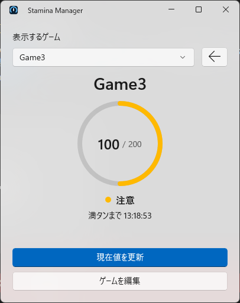

# StaminaManager

StaminaManagerは、複数のソーシャルゲームのスタミナ回復状況をまとめて管理する
Windows 11向けアプリです。

ゲーム名、現在のスタミナ、最大値、回復間隔を自由に登録できます。特定のゲームや
外部サービスには依存せず、入力した値と経過時間から現在値、満タンまでの残り時間、
満タン予定時刻を計算します。

> [!NOTE]
> 一般利用者向けの最新版は[Microsoft Store](https://apps.microsoft.com/detail/9p85qzcpwwt7?hl=ja-JP&gl=JP)から無料で入手できます。
> このリポジトリでは`.exe`、MSIXなどのバイナリを配布しません。

## 目次

- [入手方法](#入手方法)
- [スクリーンショット](#スクリーンショット)
- [主な機能](#主な機能)
- [動作環境](#動作環境)
- [基本的な使い方](#基本的な使い方)
- [通知を設定する](#通知を設定する)
- [コンパクト表示](#コンパクト表示)
- [Settings](#settings)
- [About](#about)
- [バックアップと復元](#バックアップと復元)
- [よくある質問](#よくある質問)
- [サポート](#サポート)
- [プライバシー](#プライバシー)
- [ソースからビルドする](#ソースからビルドする)
- [ライセンス](#ライセンス)

## 入手方法

[Microsoft StoreでStaminaManagerを入手する](https://apps.microsoft.com/detail/9p85qzcpwwt7?hl=ja-JP&gl=JP)

- 価格：無料
- 対応環境：Windows 11 x64
- Microsoft Store Product ID：`9P85QZCPWWT7`

インストールとアップデートはMicrosoft Storeから行えます。開発やソースコードの確認が目的の
場合は、[ソースからビルドする](#ソースからビルドする)を参照してください。

## スクリーンショット

<picture>
  <source media="(prefers-color-scheme: dark)" srcset="screenshot/Overview_dark.png">
  <source media="(prefers-color-scheme: light)" srcset="screenshot/Overview.png">
  
</picture>

## 主な機能

- 複数ゲームのスタミナをカード形式で一覧表示
- 円形メーター、数値、状態ラベルによる回復状況の表示
- 現在値と満タンまでの残り時間を経過時間から自動計算
- 1回復する時間を分と秒で設定
- ゲームごとに有効・無効を選べるWindows通知
- 満タン時刻または指定した分数前の通知
- 選択した1ゲームを大きく表示するコンパクト表示
- タスクトレイへの格納とWindowsログイン時の自動起動
- Light／DarkテーマとMica／Acrylic／Solid背景
- Acrylicの色調不透明度（`TintOpacity`）を0～100%で調整
- 日本語／Englishの表示言語を選択（変更は次回起動時に反映）
- ゲーム、画像、設定のバックアップと復元
- オフライン動作、アカウント登録・広告・テレメトリなし

## 動作環境

- Windows 11 バージョン21H2（Build 22000）以降
- x64プロセッサ
- Windowsの通知を利用する場合は、OS側でStaminaManagerの通知が許可されていること

## 基本的な使い方

### 1. ゲームを追加する

1. `Overview`にある「ゲームを追加」カードを選択します。
2. 次の項目を入力します。

   | 項目 | 説明 |
   | --- | --- |
   | ゲーム名 | 一覧に表示する任意の名前です。 |
   | ゲーム画像 | 任意です。カードに表示する画像を選択できます。 |
   | 現在のスタミナ | 入力時点のスタミナです。 |
   | スタミナの最大値 | 自然回復で到達する上限です。 |
   | 分／秒 | スタミナが1回復するまでの時間です。 |
   | 満タン通知 | このゲームの通知を受け取るか選択します。 |

3. 「保存」を選択します。

登録後は、入力した現在値と時刻を基準にスタミナが自動計算されます。ゲームとの
アカウント連携や、ゲーム内データの自動取得は行いません。

### 2. 回復状況を確認する

`Overview`では各ゲームの現在値、最大値、状態、満タンまでの残り時間を確認できます。
状態は色だけでなく、「余裕」「注意」「満タン間近」「満タン」などのラベルでも
表示されます。

| スタミナ割合 | 表示の目安 |
| --- | --- |
| 0～49% | 緑／余裕 |
| 50～80% | オレンジ／注意 |
| 81～99% | 赤／満タン間近 |
| 100% | 赤／満タン |
| 最大値を超えている | 自然回復停止中 |

### 3. 現在値を更新・登録内容を編集する

1. `Overview`で対象ゲームのカードを選択します。
2. 現在値、最大値、回復間隔、画像、通知設定などを変更します。
3. 「保存」を選択します。

現在値を保存した時刻が、新しい自動計算の基準になります。ゲームを削除する場合も、
同じ編集画面から操作できます。

## 通知を設定する

通知を受け取るには、次の両方をオンにします。

1. `Settings`の「通知」から「全回復前の通知」をオンにする
2. 通知したいゲームの編集画面で「満タン通知」をオンにする

`Settings`では、満タンの何分前に通知するかを設定できます。`0`を指定すると満タン時刻に
通知します。通知を選択するとStaminaManagerが開き、対象ゲームを確認できます。

通知が届かない場合は、`Settings`の「Windowsの通知設定を開く」からOS側の通知許可も
確認してください。

## コンパクト表示

`Overview`右上の「コンパクト表示」を選択すると、選んだ1ゲームだけを大きく表示できます。
表示するゲームは上部の選択欄から切り替えられます。

コンパクト表示では、現在値の更新とゲーム情報の編集も行えます。右上の戻るボタンで
通常の`Overview`へ戻ります。



## Settings

### 外観

- テーマ：Light／Dark
- ウィンドウの背景：Mica／Acrylic／Solid
- Acrylicの色調不透明度（0～100%）：実際にAcrylicが適用されている場合のみ変更できます。
  Mica、Solid、または環境制約によるSolidフォールバック中は無効です。

### 言語

- 表示言語：日本語／English
- 設定を保存すると、アプリの次回起動時に画面全体へ反映されます。

### 動作

- 閉じるボタンの動作：タスクトレイへ格納／アプリを終了
- Windowsログイン時に起動：オン／オフ

「タスクトレイへ格納」を選んでいる場合、閉じるボタンを押してもアプリは終了しません。
タスクトレイのStaminaManagerアイコンから、ウィンドウを開くかアプリを終了できます。

### 通知

- アプリ全体の通知のオン／オフ
- 満タンの何分前に通知するか
- Windowsの通知設定を開く

ゲームごとの通知設定は、各ゲームの編集画面で変更します。

## About

左ペインの`About`では、アプリの概要、バージョン、使用技術、プライバシーの概要を
確認できます。次のリンクは、ユーザーがボタンを押した場合だけ既定のブラウザーで開きます。

- [GitHubリポジトリ](https://github.com/saica1101/StaminaManager)
- [README](https://github.com/saica1101/StaminaManager/blob/develop/README.md)

README本文をアプリ内へ取得・表示することはありません。ライセンスと第三者コンポーネントの
最新情報は、[ライセンス監査](docs/licensing.md)と[第三者通知](ThirdPartyNotices.txt)を
確認してください。

## バックアップと復元

`Settings`の「バックアップ」から、ゲーム、画像、設定をまとめて管理できます。

- `エクスポート`：保存先を選び、現在のデータをバックアップします。
- `インポート`：バックアップの内容を確認してから、現在のデータを置き換えます。

アプリをアンインストールすると端末内のアプリデータは削除されます。再インストール後も
データを利用したい場合は、アンインストール前にエクスポートしてください。エクスポートした
バックアップファイルは、アプリをアンインストールしても自動では削除されません。

## よくある質問

### 表示されるスタミナがゲーム内の値と異なります

StaminaManagerはゲーム内データを自動取得しません。ゲーム内の現在値を確認し、対象ゲームの
編集画面またはコンパクト表示の「現在値を更新」から値を保存してください。

### 通知が届きません

以下を順に確認してください。

1. `Settings`の「全回復前の通知」がオンになっている
2. 対象ゲームの「満タン通知」がオンになっている
3. Windowsの設定でStaminaManagerの通知が許可されている
4. 通知予定時刻がまだ過ぎていない

### 閉じるボタンを押しても終了しません

`Settings`の「閉じるボタンの動作」が「タスクトレイへ格納」になっています。完全に終了する
場合はタスクトレイメニューの「終了」を選ぶか、設定を「アプリを終了」に変更してください。

### アンインストール前に何をすればよいですか

必要なデータがある場合は、`Settings`の「バックアップ」からエクスポートしてください。

## サポート

不具合の報告や機能の要望は、[GitHub Issues](https://github.com/saica1101/StaminaManager/issues)で
受け付けています。不具合を報告する際は、Windowsのバージョン、発生までの操作、再現頻度を
可能な範囲で記載してください。

## プライバシー

StaminaManagerは自動通信を行わず、アカウント登録、広告、利用状況の計測、テレメトリ、
クラッシュ情報の収集も行いません。ゲーム情報、画像、設定はWindowsのアプリ専用ローカル
領域へ保存し、アプリから外部へ自動送信しません。AboutのGitHub／READMEリンクを押した場合
だけ、固定されたHTTPSのURLを既定のブラウザーへ渡します。

詳しくは[プライバシーについて](docs/privacy.md)を参照してください。

## ソースからビルドする

### 必要な環境

- Windows 11 x64
- [.NET SDK 10.0.302](https://dotnet.microsoft.com/download/dotnet/10.0)
- PowerShell
- Windowsの開発者モード（パッケージを起動する場合）

### ビルドして起動する

```powershell
.\BuildAndRun.ps1 StaminaManager\StaminaManager.csproj
```

ビルドだけを実行する場合：

```powershell
.\BuildAndRun.ps1 StaminaManager\StaminaManager.csproj -SkipRun
```

テストを実行する場合：

```powershell
dotnet test StaminaManager.Tests\StaminaManager.Tests.csproj `
  -c Release -p:Platform=x64
```

依存パッケージのバージョンは`Directory.Packages.props`で一元管理しています。

## ライセンス

StaminaManager固有のソースコードと、このリポジトリに含まれるプロジェクト固有の素材は、
[GNU General Public License v3.0 only](LICENSE)で公開します。Windows向けのMicrosoft製
再配布可能コンポーネントと組み合わせて配布できるよう、GPLv3第7条に基づく
[追加許可](LICENSE-EXCEPTION.md)を適用します。

Microsoft Store版を含む配布時のライセンス表示や第三者コンポーネントの扱いは、配布先と
依存コンポーネントの最新文書を確認してください。第三者製のライブラリやランタイムには
それぞれのライセンスが適用されます。監査内容と確認事項は[ライセンス監査](docs/licensing.md)
を参照してください。

## サードパーティ製ソフトウェア

利用しているライブラリとライセンス情報は[ThirdPartyNotices.txt](ThirdPartyNotices.txt)を
参照してください。
